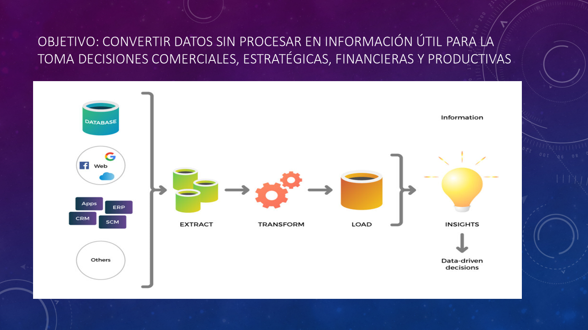
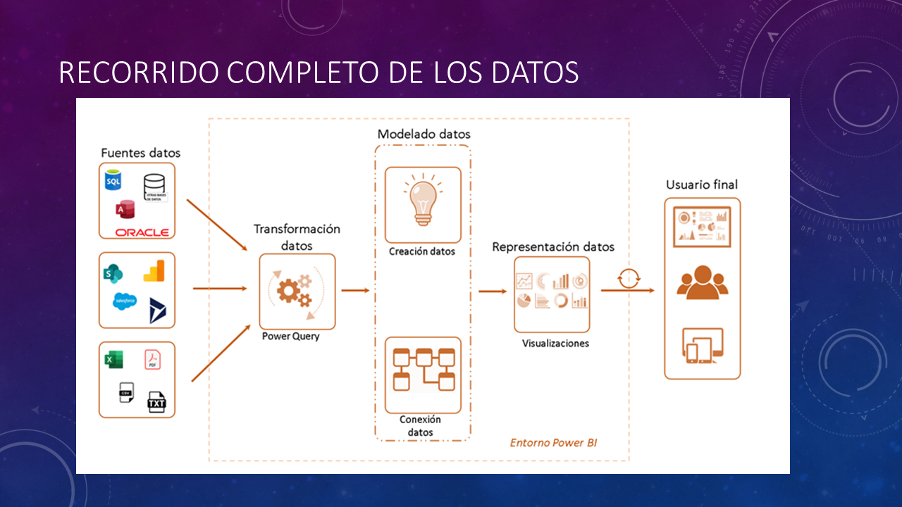
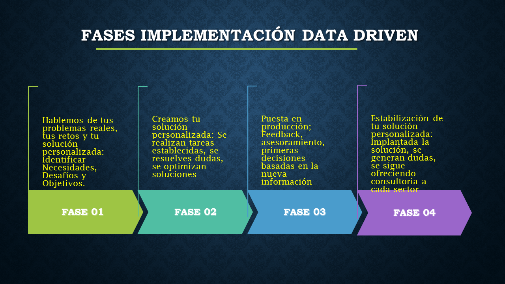
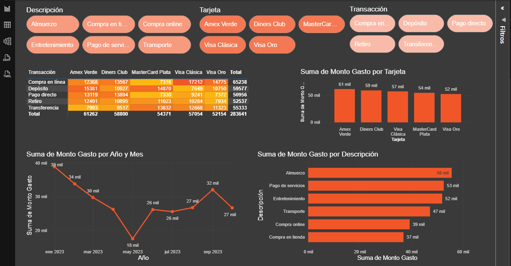
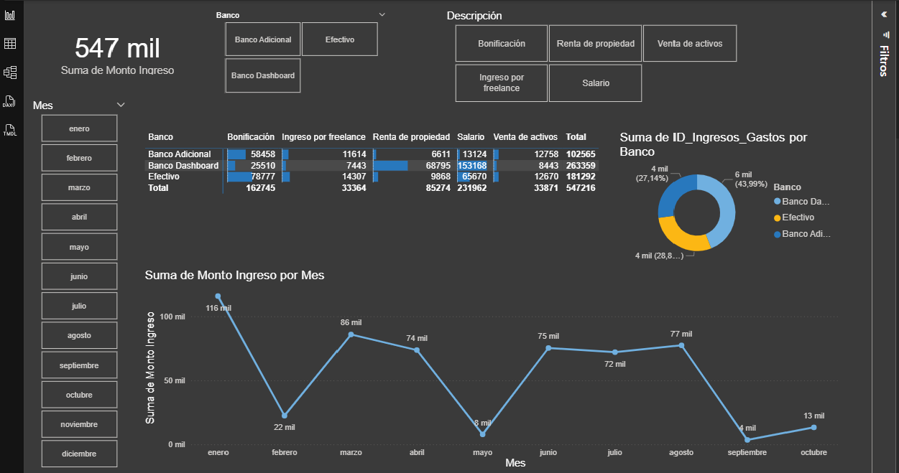
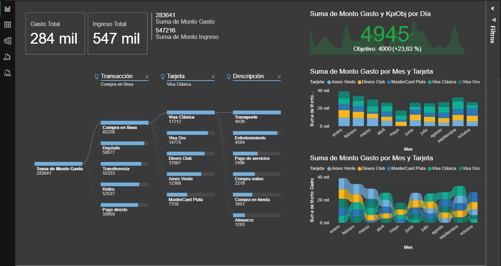
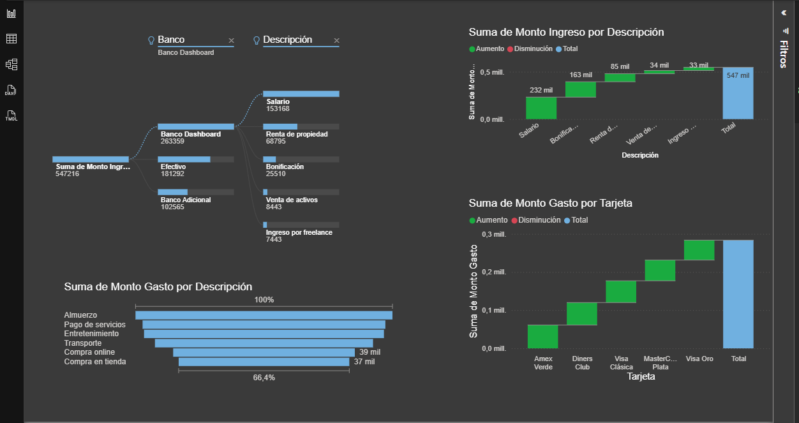

# Cultura Data Driven y Concepto Analisis de Datos  

## 📊 Analisis de Datos - Aplicaciones y Herramientas

Importancia del Analsis de Datos y Recorrido por le Beneficios, Herramientas Disponible y Ejemplos Aplicados.

## 🖼️ Vista previa

## 🚀 Tecnologías
- Power BI
- Power Point
- Conceptos y Fundamentos Analisis

##### Gabriel Gallardo
